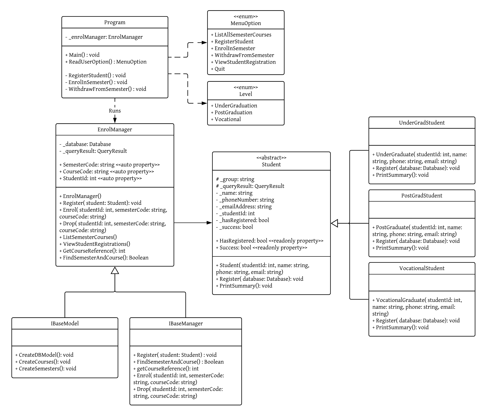

# Use of SplashKit Database to create a student enrolment program

## Table of Contents
- **[0. Pre-Guide](#0-pre-guide)**
	- [0.1 Background](#01-background)
	- [0.2 Class Diagram](#02-class-diagram)
- **[1. Student.cs](#1-studentcs)**
	- [1.1 Define required variables, fields and properties](#11-define-required-variables-fields-and-properties)
	- [1.2 Create class constructor](#12-create-class-constructor)
	- [1.3 Create the rest of the class](#13-create-the-rest-of-the-class)
- **[2. UnderGradStudent.cs](#2-undergradstudentcs)**
	- [2.1 Create class constructor](#21-create-class-constructor)
	- [2.2 Create the rest of the class](#22-create-the-rest-of-the-class)
- **[3. PostGradStudent.cs](#3-postgradstudentcs)**
	- [3.1 Create class constructor](#31-create-class-constructor)
	- [3.2 Create the rest of the class](#32-create-the-rest-of-the-class)
- **[4. VocationalStudent.cs](#4-vocationalstudentcs)**
	- [4.1 Create class constructor](#41-create-class-constructor)
	- [4.2 Create the rest of the class](#42-create-the-rest-of-the-class)
- **[5. IBaseManager.cs](#5-ibasemanagercs)**
	- [5.1 Define required interface members](#51-define-required-interface-members)
- **[6. IBaseModel.cs](#6-ibasemodelcs)**
	- [6.1 Define required interface members](#61-define-required-interface-members)  
- **[7. EnrolmentManager.cs](#7-enrolmentmanagercs)**
	- [7.1 Define required variables, fields and properties](#71-define-required-variables-fields-and-properties)
	- [7.2 Create class constructor](#72-create-class-constructor)
	- [7.3 Create the rest of the class](#73-create-the-rest-of-the-class)
- **[8. Program.cs](#8-programcs)**
	- [8.1 Define required variables, fields and properties](#81-define-required-variables-fields-and-properties)
	- [8.2 Create the main method](#82-create-the-main-method)
	- [8.3 Reading user options](#83-reading-user-options)
	- [8.4 Reading student details](#84-reading-student-details)
	- [8.5 Reading enrolment registration details](#85-reading-enrolment-registration-details)
	- [8.6 Reading enrolment withdrawal details](#86-reading-enrolment-withdrawal-details)
- **[9. Enumerations](#9-enumeration)**
	- [9.1 Create enum menu options](#91-create-enum-menu-options)
	- [9.2 Create enum student level](#92-create-enum-student-level)

## Pre-Guide
#### Before writing the code, some installation need to be done
1. Install SplashKit SDK and other dependent libraries using the [link](http://www.splashkit.io/articles/installation/).

2. Install sqllite browser binaries specific to our operating system from the https://sqlitebrowser.org/dl/.

3. We will have to create a new database file using the sqllite browser and place it in the Resources folder of our program workspace.

#### 0.1 Background
This article will guide you to create student registration program.

The program makes use of SplashKit's one of the advanced features i.e. Splashkit Database.

Once started, the program will provide a list of options for the admin to select and perform an action.

Following behaviours or options were added to this program

```
1. Listing All Semester Courses
2. Registering a New Student
3. Enrolling Student In Semester
4. Withdraw Student From Semester
5. View Student Registrations
6. Quit
```

If option 1 is selected, the program will list all the semester courses available from the university database.

If option 2 is selected, the program will allow the admin to register a new student into the university database.

If option 3 is selected, the program will enrol the student into a semester course and save this information in the university database.

If option 4 is selected, the program will withdraw the student from a semester course and save this information in the university database.

If option 5 is selected, the program will view the student registrations stored in the university database.

If option 6 is selected, the program will quit running.

#### 0.2 Class Diagram

<iframe id="kaltura_player" src="https://cdnapisec.kaltura.com/p/2006242/sp/200624200/embedIframeJs/uiconf_id/32026192/partner_id/2006242?iframeembed=true&playerId=kaltura_player&entry_id=0_udd05fr6&flashvars[streamerType]=auto&amp;flashvars[localizationCode]=en&amp;flashvars[watermark.watermarkPath]=https://kms-a.akamaihd.net/dc-0/5.90.20/public/img/kalturalogo_watermark.png&amp;flashvars[playPauseBtn.plugin]=false&amp;flashvars[topBarContainer.plugin]=false&amp;flashvars[currentTimeLabel.plugin]=false&amp;flashvars[durationLabel.plugin]=false&amp;flashvars[scrubber.plugin]=false&amp;flashvars[volumeControl.plugin]=false&amp;flashvars[fullScreenBtn.plugin]=true&amp;flashvars[controlBarContainer.plugin]=true&amp;flashvars[largePlayBtn.plugin]=false&amp;flashvars[loadingSpinner.plugin]=false&amp;flashvars[Kaltura.addCrossoriginToIframe]=true&amp;&wid=0_ldh6nph1" width="500" height="281" allowfullscreen webkitallowfullscreen mozAllowFullScreen allow="autoplay *; fullscreen *; encrypted-media *" sandbox="allow-forms allow-same-origin allow-scripts allow-top-navigation allow-pointer-lock allow-popups" frameborder="0" title="Kaltura Player"></iframe>



`ref`: based on the article https://www.futurelearn.com/courses/sit771-fl3/6/steps/543293)

### 1. Student.cs
#### This class defines an abstract model of a student, that other classes inherits and implements or overrides the parent class methods
- This public class named `Student`
- This class is defined as an `abstract` class by adding the modifier `abstract` to the class declaration (`ref`: based on the article https://www.futurelearn.com/courses/sit771-fl4/6/steps/543309)
- This class will be inherited from the child classes `UnderGradStudent`, `PostGradStudent` and `VocationalStudent`

##### 1.1 Define required variables, fields and properties
- Create private `_name` field as `string` to store the name of the student
- Create private `_phoneNumber` field as `string` to store the phone number of the student
- Create private `_emailAddress` field as `string` to store the email address of the student
- Create protected `_group` field as `string` to store the group of the student
- Create private `_studentId` field as `integer` to store the unique student id
- Create private `_hasRegistered` field as `bool` with the default value `false`, so that later we can set the state if the student is previously registered.
- Create private `_success` field as `bool` with the default value `false`, so that later we can store the status of new registration.
- Create protected `_queryResult` field as `QueryResult` to store the result of the database query along with it status.
- Create public `HasRegistered` read-only property as `bool` to use the status of student's previous registration from the inherited class members.
- Create public `HasRegistered` read-only property as `bool` to use the status of student new registration from the inherited class members.

##### 1.2 Create class constructor
- The constructor will be passed in StudentId, Name Phone, Email parameters, so that it uses these details to register the student.
	- Once started, the constructor will initialise the abstract class fields with the passed in parameters.

```
public Student(int studentId, string name, string phone, string email)
{
	_studentId = studentId;
	_name = name;
	_phoneNumber = phone;
	_emailAddress = email;
}
```

##### 1.3 Create the rest of the class
- We will define the virtual method `Register()` in the `Student` class. This method will be passed in Database parameter to interact with the database for student registration (`ref`: based on the article https://www.futurelearn.com/courses/sit771-fl4/6/steps/543307)
	- Once started, this method will run the sql query using the following code `database.RunSql("SELECT * FROM Student WHERE Student_Id = " + _studentId + ";");` and store the result in the `_queryResult` field.
	- Next, the method checks the status of the registration and prints it to the console.

```
public virtual void Register(Database database)
{
	_queryResult = database.RunSql("SELECT * FROM Student WHERE Student_Id = " + _studentId + ";");

	if (_queryResult.HasRow)
	{
		// Record that student is already registered...
		_hasRegistered = true;
	}

	// Ensure that we haven't already enrolled the student
	if (HasRegistered)
	{
		throw new InvalidOperationException("Registering same student more than once.");
	}

	_queryResult = database.RunSql("INSERT INTO Student VALUES (" + _studentId + ", '" + _name + "', '" + _phoneNumber + "', '" + _emailAddress + "', '" + _group + "');");

	if (!_queryResult.Successful)
	{
		throw new InvalidOperationException("Unexpected error occured during student registration");
	}
	else
	{
		_success = true;
	}

	SplashKit.FreeQueryResult(_queryResult);
}
```

- We will define the abstract method `PrintSummary()` in the `Student` class. This method will have no implementation, so the child classes can implement it as required (`ref`: based on the article https://www.futurelearn.com/courses/sit771-fl4/6/steps/543309)

```
public abstract void PrintSummary();
```

### 2. UnderGradStudent.cs
#### This class sets the group the student belongs i.e. `UG-UnderGraduate` and completes the registration in the university database for any enrolments
- This public class named `UnderGradStudent`
- This class inherits from the parent class `Student` (`ref`: based on the article https://www.futurelearn.com/courses/sit771-fl4/6/steps/543306)

##### 2.1 Create class constructor
- The constructor will be passed in StudentId, Name Phone, Email parameters, so that it uses these details to register the student.
	- Once started, the constructor will call the base class constructor using the same parameters and executes the statements within it first and returns to the inherited class.
	- Next, the constructor sets the group the student belongs in the field `_group`

```
public UnderGradStudent(int studentId, string name, string phone, string email) : base(studentId, name, phone, email)
{
	_group = "UG-UnderGraduate";
}
```

##### 2.2 Create the rest of the class
- We will override the `Register()` method in the `UnderGraduate` class. This method will be passed in Database parameter to interact with the database for student registration (`ref`: based on the article https://www.futurelearn.com/courses/sit771-fl4/6/steps/543307)
	- Once started, this method will call the `Register` virtual method implemented in the abstract class and executes the statements within it first and returns to the calling method.
	- Next, the method checks the status of the registration and prints it to the console.

```
public override void Register(Database database) {

	base.Register(database); // call register from within this class.

	if (Success)
	{
		Console.WriteLine("\nINFO - UnderGraduate Student registration is successful");
	}
}
```

- Next, we will implement the abstract method `PrintSummary()` in the `UnderGraduate` class. This method will used to print status of registration specific to the `UnderGraduate` student
	- Once started, this method will read the value of `Success` property and if its true, sends a message to the console

```
public override void PrintSummary() {
	if (Success)
	{
		Console.WriteLine("\nINFO - UnderGraduate Student registration is successful");
	}
}
```

### 3. PostGradStudent.cs
#### This class sets the group the student belongs i.e. `PG-PostGraduate` and completes the registration in the university database for any enrolments
- This public class named `PostGradStudent`
- This class inherits from the parent class `Student` (`ref`: based on the article https://www.futurelearn.com/courses/sit771-fl4/6/steps/543306)

##### 3.1 Create class constructor
- The constructor will be passed in StudentId, Name Phone, Email parameters, so that it uses these details to register the student.
	- Once started, the constructor will call the base class constructor using the same parameters and executes the statements within it first and returns to the inherited class.
	- Next, the constructor sets the group the student belongs in the field `_group`

```
public PostGradStudent(int studentId, string name, string phone, string email) : base(studentId, name, phone, email)
{
	_group = "PG-PostGraduate";
}
```

##### 3.2 Create the rest of the class
- We will override the `Register()` method in the `PostGraduate` class. This method will be passed in Database parameter to interact with the database for student registration (`ref`: based on the article https://www.futurelearn.com/courses/sit771-fl4/6/steps/543307)
	- Once started, this method will call the `Register` virtual method implemented in the abstract class and executes the statements within it first and returns to the calling method.
	- Next, the method checks the status of the registration and prints it to the console.

```
public override void Register(Database database)
{
	base.Register(database); // call register from within this class.

	if (Success)
	{
		Console.WriteLine("\nINFO - PostGraduate Student registration is successful");
	}
}
```

- Next, we will implement the abstract method `PrintSummary()` in the `PostGraduate` class. This method will used to print status of registration specific to the `PostGraduate` student
	- Once started, this method will read the value of `Success` property and if its true, sends a message to the console

```
public override void PrintSummary() {
	if (Success)
	{
		Console.WriteLine("\nINFO - PostGraduate Student registration is successful");
	}
}
```

### 4. VocationalStudent.cs
#### This class sets the group the student belongs i.e. `VC-Vocational` and completes the registration in the university database for any enrolments
- This public class named `VocationalStudent`
- This class inherits from the parent class `Student` (`ref`: based on the article https://www.futurelearn.com/courses/sit771-fl4/6/steps/543306)

##### 4.1 Create class constructor
- The constructor will be passed in StudentId, Name Phone, Email parameters, so that the constructor uses these details to register the student (`ref`: based on the article https://www.futurelearn.com/courses/sit771-fl4/6/steps/543307)
	- Once started, the constructor will call the base class constructor using the same parameters and executes the statements within it first and returns to the inherited class.
	- Next, the constructor sets the group the student belongs in the field `_group`

```
public VocationalStudent(int studentId, string name, string phone, string email) : base(studentId, name, phone, email)
{
	_group = "VC-Vocational";
}
```

##### 4.2 Create the rest of the class
- We will override the `Register()` method in the `Vocational` class. This method will be passed in Database parameter to interact with the database for student registration.
	- Once started, this method will call the `Register` virtual method implemented in the abstract class and executes the statements within it first and returns to the calling method.
	- Next, the method checks the status of the registration and prints it to the console.

```
public override void Register(Database database)
{
	base.Register(database); // call register from within this class.

	if (Success)
	{
		Console.WriteLine("\nINFO - Vocational Student registration is successful");
	}
}
```

- Next, we will implement the abstract method `PrintSummary()` in the `Vocational` class. This method will used to print status of registration specific to the `Vocational` student
	- Once started, this method will read the value of `Success` property and if its true, sends a message to the console

```
public override void PrintSummary() {
	if (Success)
	{
		Console.WriteLine("\nINFO - UnderGraduate Student registration is successful");
	}
}
```

### 5. IBaseManager.cs
#### This class provides a definition of enrol manager interface members that an inherited class can use to implement them (`ref`: based on the article https://www.futurelearn.com/courses/sit771-fl4/6/steps/543306)
- This public class named `IBaseManager`

##### 5.1 Define required interface members

```
public interface IBaseManager
{
	void Register(Student student);
	Boolean FindSemesterAndCourse();
	int GetCourseReference();
	void Enrol(int studentId, string semesterCode, string courseCode);
	void Drop(int studentId, string semesterCode, string courseCode);
}
```

### 6. IBaseModel.cs
#### This class provides a definition of interface members for e.g. database model creation, that an inherited class can use to implement them (`ref`: based on the article https://www.futurelearn.com/courses/sit771-fl4/6/steps/543306)
- This public class named `IBaseModel`

##### 6.1 Define required interface members

```
public interface IBaseModel
{
	void CreateDBModel();
	void CreateCourses();
	void CreateSemesters();
}
```

### 7. EnrolmentManager.cs
#### This class control the registration of new students and enrolment of students in one or more semester courses.
- This public class named `EnrolmentManager`

##### 7.1 Define required variables, fields and properties
- Create private `_database` field as `Database` to store the database object we use in the program
- Create private `_queryResult` field as `QueryResult` to store the queryresult object that stores the response of the run sql query.
- Create public `SemesterCode` auto-property as `string` to capture the semester code passed in the `Enrol()` and `Drop()` method parameters.
- Create public `CourseCode` auto-property as `string` to capture the course code passed in the `Enrol()` and `Drop()` method parameters.
- Create public `StudentId` auto-property as `int` to capture the student id passed in the `Enrol()` and `Drop()` method parameters.

##### 7.2 Create class constructor
The constructor will be called when a new `EnrolManager` object is created

- Once started, the constructor will load and opens the sqllite database file from the `Resources/databases` folder.

```
public EnrolManager()
{
	/*
	Create or access a database
	*/
	_database = SplashKit.OpenDatabase("UnivDatabase", "uniregistration.db");
}
```

##### 7.3 Create the rest of the class
- The `Register` method will be passed in Student object to perform the student registration and print the operation status.
	- Once started, this will call the `Register` method using the `student` object and this method will be passed in the with `_database` object for the method execution.
	- Next, this method will call the `PrintSummary` method using the `student` object and prints the status of registration.

```
public void Register(Student student)
{
	student.Register(_database);
	student.PrintSummary();
}
```
- The `GetCourseReference` method will return the unique id by running the sql query with the passed in auto-property values `SemesterCode` and `CourseCode`

```
public int GetCourseReference()
{
	_queryResult = _database.RunSql("SELECT Unique_Id FROM Semester WHERE Semester_Code = '" + SemesterCode + "' AND Course_Code = '" + CourseCode + "';");

	if (!_queryResult.Successful)
	{
		throw new InvalidOperationException("Unexpected error occured while querying semester course details'");
	}

	return _queryResult.QueryColumnForInt(0);
}
```
- The `FindSemesterAndCourse` method finds the semester course and returns `true` or `false` by running the sql query with the passed in auto-property values `SemesterCode` and `CourseCode`

```
public Boolean FindSemesterAndCourse()
{
	_queryResult = _database.RunSql("SELECT Unique_Id FROM Semester WHERE Semester_Code = '" + SemesterCode + "' AND Course_Code = '" + CourseCode + "';");

	return _queryResult.HasRow;
}
```
- The `Enrol` method will be passed in the `studentId`, `semesterCode`, `courseCode` parameters, so the method uses these parameter values to enrol the student in a semester course by updating the details in the database table `Enrolment`.
	- Once started, the method will initialise the auto-properties `StudentId`, `SemesterCode`, `CourseCode` with the passed in parameter values.
	- Next, in the `if` condition, we will check the course availability in the given semester
		- When returns `false`, statement to display the `error` will be executed in the `else` block.
		- Otherwise, when `if` condition returns `true`, we will retrieve the `Unique Id` from the database table `Enrolment`.
	- Next, within the `if` block, we have another `if` condition to check whether the student has an existing enrolment for the semester course.
		- When returns `false`, we execute an sql statement to insert a new record into database table `Enrolment` to complete the enrolment.
		- Otherwise, when `if` condition returns `true`,statement to display the `error` will be executed in the nested `else` block.

```
public void Enrol(int studentId, string semesterCode, string courseCode)
{
	/*
	Initialise auto-propeties with the method arguments
		*/
	StudentId = studentId;
	SemesterCode = semesterCode;
	CourseCode = courseCode;

	if (FindSemesterAndCourse())
	{
		int externalId = GetCourseReference();
		_queryResult = _database.RunSql("SELECT Unique_Id FROM Enrolment WHERE Student_Id = " + studentId + " AND External_Ref_Id = " + externalId + ";");
		if (!_queryResult.HasRow)
		{
			_queryResult = _database.RunSql("INSERT INTO Enrolment (\"Student_Id\",\"External_Ref_Id\") VALUES (" + studentId + "," + externalId + ");");
			if (!_queryResult.Successful)
			{
				throw new InvalidOperationException("Unexpected error occured while enroling a semester course'");
			}
			else
			{
				Console.WriteLine("\nINFO - Student enrolment to the Semester Course is Successful");
			}
		}
		else
		{
			Console.WriteLine("\nERROR - Student is already enrolled to the semester course. Please check the details again.");
		}
	}
	else
	{
		Console.WriteLine("\nERROR - No matching Semester Course found. Please check the details again.");
	}
	SplashKit.FreeQueryResult(_queryResult);
}
```
- The `Drop` method will be passed in the `studentId`, `semesterCode`, `courseCode` parameters, so the method uses these parameter values to enrol the student in a semester course by updating the details in the database table `Enrolment`.
	- Once started, the method will initialise the auto-properties `StudentId`, `SemesterCode`, `CourseCode` with the passed in parameter values.
	- Next, in the `if` condition, we will check the course availability in the given semester
		- When returns `true`, statement to display the `error` will be executed in the `else` block.
		- Otherwise, when `if` condition returns `false`, we will retrieve the `Unique Id` from the database table `Enrolment`.
	- Next, within the `if` block, we have another `if` condition to check whether the student has an existing enrolment for the semester course.
		- When returns `true`, we execute an sql statement to delete the enrolment record into database table `Enrolment` to withdraw from the semester course.
		- Otherwise, when `if` condition returns `false`,statement to display the `error` will be executed in the nested `else` block.

```
public void Drop(int studentId, string semesterCode, string courseCode)
{
	/*
	Initialise auto-properties with the method arguments
		*/
	StudentId = studentId;
	SemesterCode = semesterCode;
	CourseCode = courseCode;

	if (FindSemesterAndCourse())
	{
		int externalId = GetCourseReference();
		_queryResult = _database.RunSql("SELECT Unique_Id FROM Enrolment WHERE Student_Id = " + studentId + " AND External_Ref_Id = " + externalId + ";");
		if (_queryResult.HasRow)
		{
			_queryResult = _database.RunSql("DELETE FROM Enrolment WHERE Student_Id = " + studentId + " AND External_Ref_Id = " + externalId + ";");
			if (!_queryResult.Successful)
			{
				throw new InvalidOperationException("Unexpected error occured while dropping the enroled semester course'");
			}
			else
			{
				Console.WriteLine("\nINFO - Student unenrolment to the Semester Course is Successful");
			}
		}
		else
		{
			Console.WriteLine("\nERROR - Student is not enrolled to the semester course. Please check the details again.");
		}
	}
	else
	{
		Console.WriteLine("\nERROR - No matching Semester Course found. Please check the details again.");
	}
	SplashKit.FreeQueryResult(_queryResult);
}
```
- The `ViewStudentRegistrations` will print the list of all student registrations to the console by running an sql statement against the `Student`, `Semester` and `Course` database tables.

```
public void ViewStudentRegistrations()
{
	_queryResult = _database.RunSql("SELECT stu.Student_Id, stu.Name, sem.Semester_Code, c.Course_Code, c.Course_Name FROM Student stu, Semester sem, Course c, Enrolment e WHERE stu.Student_id = e.Student_id AND e.External_Ref_Id = sem.Unique_Id AND sem.Course_Code = c.Course_Code;");

	if (!_queryResult.Successful)
	{
		throw new InvalidOperationException("Unexpected error occured while retrieving all registrations'");
	}

	/*
	Looping over query results
	*/
	Console.WriteLine("---------------------------------------------------------------------");
	Console.WriteLine("Student Id | Student Name | Semester Name | Course Code | Course Name");
	Console.WriteLine("---------------------------------------------------------------------");
	do
	{
		if (_queryResult.HasRow)
		{
			Console.WriteLine(_queryResult.QueryColumnForString(0) + "   | " + _queryResult.QueryColumnForString(1)
			+ "   | " + _queryResult.QueryColumnForString(2) + " | " + _queryResult.QueryColumnForString(3)
			+ "   | " + _queryResult.QueryColumnForString(4));
		}

	} while (_queryResult.GetNextRow());
	Console.WriteLine("---------------------------------------------------------------------\n");
}
```
- The `CreateDBModel` method will create the data model required to run the student enrolment program
	- When started, the method will create `Student` table in the database
	- Next, the method will call the `CreateCourses` method to create the `Course` table and load the available courses
	- Later, the method will call the `CreateSemesters` method to create the `Semester` table and load the available semesters
	- And finally, the method will create `Enrolment` table in the database

```
public void CreateDBModel()
{
	/*
	Create or access 'Student' table
		*/
	_queryResult = _database.RunSql("SELECT * FROM Student;");

	if (!_queryResult.Successful)
	{
		_queryResult = _database.RunSql(GetCreateTableStatement("Student"));
	}
	else
	{
		_queryResult = _database.RunSql("DELETE FROM Student;");
	}

	SplashKit.FreeQueryResult(_queryResult);

	/*
	Create or access 'Course' table
		*/
	CreateCourses();
	/*
	Create or access 'Semester' table
		*/
	CreateSemesters();
	/*
	Create or access 'Enrolment' table
		*/
	_queryResult = _database.RunSql("SELECT * FROM Enrolment;");

	if (!_queryResult.Successful)
	{
		_queryResult = _database.RunSql(GetCreateTableStatement("Enrolment"));
	}
	else
	{
		_queryResult = _database.RunSql("DELETE FROM Enrolment;");
	}

	SplashKit.FreeQueryResult(_queryResult);
}
```

- The `CreateCourses` method will create the `Course` table and load the `courses` data

```
public void CreateCourses()
{
	/*
	Create Table 'Course'
	*/
	_queryResult = _database.RunSql(GetCreateTableStatement("Course"));

	if (!_queryResult.Successful)
	{
		throw new InvalidOperationException("Unexpected error occured during creation of database table 'Course'");
	}

	_database.RunSql("INSERT INTO Course VALUES (\"UG001\", \"Object-Orient Programming\", \"AQF - Level 7\");");
	_database.RunSql("INSERT INTO Course VALUES (\"UG002\", \"Software Analysis & Modelling\", \"AQF - Level 7\");");
	_database.RunSql("INSERT INTO Course VALUES (\"UG003\", \"Database Programming\", \"AQF - Level 7\");");
	_database.RunSql("INSERT INTO Course VALUES (\"PG001\", \"Cloud Computing\", \"AQF - Level 9\");");
	_database.RunSql("INSERT INTO Course VALUES (\"PG002\", \"Big Data Analytics\", \"AQF - Level 9\");");
	_database.RunSql("INSERT INTO Course VALUES (\"PG003\", \"Web Programming\", \"AQF - Level 8\");");
	_database.RunSql("INSERT INTO Course VALUES (\"VC001\", \"Internet Of Things\", \"AQF - Level 4\");");

	SplashKit.FreeQueryResult(_queryResult);
}
```
- The `CreateSemesters` method will create the `Semester` table and load the `semester` data

```
public void CreateSemesters()
{
	/*
	Create Table 'Semester'
	*/
	_queryResult = _database.RunSql(GetCreateTableStatement("Semester"));

	if (!_queryResult.Successful)
	{
		throw new InvalidOperationException("Unexpected error occured during creation of database table 'Semester'");
	}

	_database.RunSql("INSERT INTO Semester (\"Semester_Code\",\"Semester_Name\",\"Course_Code\") VALUES (\"2019T1\",\"Year 2019 Trimester 1\",\"UG001\");");
	_database.RunSql("INSERT INTO Semester (\"Semester_Code\",\"Semester_Name\",\"Course_Code\") VALUES (\"2019T2\",\"Year 2019 Trimester 2\",\"UG002\");");
	_database.RunSql("INSERT INTO Semester (\"Semester_Code\",\"Semester_Name\",\"Course_Code\") VALUES (\"2019T3\",\"Year 2019 Trimester 3\",\"UG003\");");
	_database.RunSql("INSERT INTO Semester (\"Semester_Code\",\"Semester_Name\",\"Course_Code\") VALUES (\"2019T1\",\"Year 2019 Trimester 1\",\"PG001\");");
	_database.RunSql("INSERT INTO Semester (\"Semester_Code\",\"Semester_Name\",\"Course_Code\") VALUES (\"2019T2\",\"Year 2019 Trimester 2\",\"PG002\");");
	_database.RunSql("INSERT INTO Semester (\"Semester_Code\",\"Semester_Name\",\"Course_Code\") VALUES (\"2019T3\",\"Year 2019 Trimester 3\",\"PG003\");");
	_database.RunSql("INSERT INTO Semester (\"Semester_Code\",\"Semester_Name\",\"Course_Code\") VALUES (\"2019T1\",\"Year 2019 Trimester 1\",\"VC001\");");
	_database.RunSql("INSERT INTO Semester (\"Semester_Code\",\"Semester_Name\",\"Course_Code\") VALUES (\"2019T2\",\"Year 2019 Trimester 2\",\"VC001\");");
	_database.RunSql("INSERT INTO Semester (\"Semester_Code\",\"Semester_Name\",\"Course_Code\") VALUES (\"2019T3\",\"Year 2019 Trimester 3\",\"VC001\");");
	_database.RunSql("INSERT INTO Semester (\"Semester_Code\",\"Semester_Name\",\"Course_Code\") VALUES (\"2020T1\",\"Year 2020 Trimester 1\",\"UG001\");");
	_database.RunSql("INSERT INTO Semester (\"Semester_Code\",\"Semester_Name\",\"Course_Code\") VALUES (\"2020T2\",\"Year 2020 Trimester 2\",\"UG002\");");
	_database.RunSql("INSERT INTO Semester (\"Semester_Code\",\"Semester_Name\",\"Course_Code\") VALUES (\"2020T3\",\"Year 2020 Trimester 3\",\"UG003\");");
	_database.RunSql("INSERT INTO Semester (\"Semester_Code\",\"Semester_Name\",\"Course_Code\") VALUES (\"2020T1\",\"Year 2020 Trimester 1\",\"PG001\");");
	_database.RunSql("INSERT INTO Semester (\"Semester_Code\",\"Semester_Name\",\"Course_Code\") VALUES (\"2020T2\",\"Year 2020 Trimester 2\",\"PG002\");");
	_database.RunSql("INSERT INTO Semester (\"Semester_Code\",\"Semester_Name\",\"Course_Code\") VALUES (\"2020T3\",\"Year 2020 Trimester 3\",\"PG003\");");
	_database.RunSql("INSERT INTO Semester (\"Semester_Code\",\"Semester_Name\",\"Course_Code\") VALUES (\"2020T1\",\"Year 2020 Trimester 1\",\"VC001\");");
	_database.RunSql("INSERT INTO Semester (\"Semester_Code\",\"Semester_Name\",\"Course_Code\") VALUES (\"2020T2\",\"Year 2020 Trimester 2\",\"VC001\");");
	_database.RunSql("INSERT INTO Semester (\"Semester_Code\",\"Semester_Name\",\"Course_Code\") VALUES (\"2020T3\",\"Year 2020 Trimester 3\",\"VC001\");");

	SplashKit.FreeQueryResult(_queryResult);
}
```
- The `GetCreateTableStatement` method will be passed in the `tableName` and returns the `CREATE TABLE` sql to the calling method.


```
public String GetCreateTableStatement(String tableName)
{
	string statement = "";
	switch (tableName)
	{
		case "Student":
			statement = "CREATE TABLE 'Student' ('Student_Id' INTEGER NOT NULL, 'Name' TEXT NOT NULL, 'Phone_Number' NUMERIC, 'Email_Address' TEXT, 'Study_Group' TEXT, PRIMARY KEY('Student_Id'));";
			break;
		case "Enrolment":
			statement = "CREATE TABLE 'Enrolment' ('Unique_Id' INTEGER PRIMARY KEY AUTOINCREMENT, 'Student_Id' INTEGER NOT NULL, 'External_Ref_Id' INTEGER NOT NULL);";
			break;
		case "Semester":
			statement = "CREATE TABLE 'Semester' ('Unique_Id' INTEGER PRIMARY KEY AUTOINCREMENT, 'Semester_Code' TEXT NOT NULL, 'Semester_Name' TEXT, 'Course_Code' TEXT);";
			break;
		case "Course":
			statement = "CREATE TABLE 'Course' ('Course_Code' TEXT NOT NULL, 'Course_Name' TEXT, 'AQF_Level' TEXT, PRIMARY KEY('Course_Code'));";
			break;
		default:
			break;
	}
	return statement;
}
```
- The `GetDropTableStatement` method will be passed in the `tableName` and returns the `DROP TABLE` sql to the calling method.

```
public String GetDropTableStatement(String tableName)
{
	string statement = "";
	switch (tableName)
	{
		case "Student":
			statement = "DROP TABLE 'Student';";
			break;
		case "Semester":
			statement = "DROP TABLE 'Semester';";
			break;
		case "Enrolment":
			statement = "DROP TABLE 'Enrolment';";
			break;
		case "Course":
			statement = "DROP TABLE 'Course';";
			break;
		default:
			break;
	}
	return statement;
}
```

### 8. Program.cs
#### This class describes the static method containing the scope of program execution

##### 8.1 Define required variables, fields and properties
- Create static `_enrolManager` field as `EnrolManager` to store the enrolmanager object we use in the program.

##### 8.2 Create the main method
- This class contains the static `main` method that will wrap `ReadUserOption()` method and `Switch` statement handling program execution in a do while loop, and continues looping through again and again until the user selects option 6.

```
public static void Main()
{
	MenuOption userSelection;
	_enrolManager = new EnrolManager();
	_enrolManager.CreateDBModel();

	do
	{
		userSelection = ReadUserOption();
		switch (userSelection)
		{
			case MenuOption.ListSemesterCourses:
				_enrolManager.ListSemesterCourses();
				break;
			case MenuOption.RegisterStudent:
				RegisterStudent();
				break;
			case MenuOption.EnrolInSemester:
				EnrolInSemester();
				break;
			case MenuOption.WithdrawFromSemester:
				WithdrawFromSemester();
				break;
			case MenuOption.ViewStudentRegistrations:
				_enrolManager.ViewStudentRegistrations();
				break;
			case MenuOption.Quit:
				Console.WriteLine(" Quit ");
				break;
		}
	} while (userSelection != MenuOption.Quit);

	SplashKit.FreeAllDatabases();
	SplashKit.FreeAllQueryResults();
}
```

##### 8.3 Reading user options
- The `ReadUserOption()` static method will display the program options for the admin selection and returns to calling method

```
public static MenuOption ReadUserOption()
{
	int option;
	do
	{
	Console.WriteLine("\nSelect The Number from below MENU Option");
	Console.WriteLine(" 1. Enter to List All Semester Courses");
	Console.WriteLine(" 2. Enter to Register New Student");
	Console.WriteLine(" 3. Enter to Enrol Student In Semester");
	Console.WriteLine(" 4. Enter to Withdraw Student From Semester");
	Console.WriteLine(" 5. Enter to View Student Registrations");
	Console.WriteLine(" 6. Quit \n ");
	try
	{
		option = Convert.ToInt32(Console.ReadLine());
	}
	catch (System.Exception)
	{
		option = -1;
	}

	} while (option < 1 || option > 6);
	return (MenuOption)(option - 1);
}
```

##### 8.4 Reading student details

- The `RegisterStudent()` static method will collect the student details and uses the `_enrolManager` object to complete the registration.

```
private static void RegisterStudent()
{
	Console.WriteLine("\nEnter student type - '1' for Undergraduate, '2' for Postgraduate and '3' for 'Vocational' : ");
	int option = Convert.ToInt32(Console.ReadLine());

	Console.WriteLine("\nEnter student id: ");
	int id = Convert.ToInt32(Console.ReadLine());

	Console.WriteLine("\nEnter student name: ");
	string name = Console.ReadLine();

	Console.WriteLine("\nEnter student phone number: ");
	string phone = Console.ReadLine();

	Console.WriteLine("\nEnter student email address: ");
	string email = Console.ReadLine();

	switch ((Level)(option - 1))
	{
		case Level.UnderGraduation:
			UnderGradStudent ugStudent = new UnderGradStudent(id, name, phone, email);
			_enrolManager.Register(ugStudent);
			break;
		case Level.PostGraduation:
			PostGradStudent pgStudent = new PostGradStudent(id, name, phone, email);
			_enrolManager.Register(pgStudent);
			break;
		case Level.Vocational:
			VocationalStudent vcStudent = new VocationalStudent(id, name, phone, email);
			_enrolManager.Register(vcStudent);
			break;
		default:
			throw new InvalidOperationException("Student type selection is incorrect or record not found");
	}
}
```

##### 8.5 Reading enrolment registration details
- The `EnrolInSemester()` static method will collect the student id, semester name and course code details and uses the `_enrolManager` object to complete the enrolment.

```
private static void EnrolInSemester()
{
	Console.WriteLine("\nEnter student id: ");
	int id = Convert.ToInt32(Console.ReadLine());

	Console.WriteLine("\nEnter semester name: ");
	string semester = Console.ReadLine();

	Console.WriteLine("\nEnter course code: ");
	string course = Console.ReadLine();

	_enrolManager.Enrol(id, semester, course);
}
```

##### 8.6 Reading enrolment withdrawal details
- The `WithdrawFromSemester()` static method will collect the student id, semester name and course code details and uses the `_enrolManager` object to cancel the enrolment.

```
private static void WithdrawFromSemester()
{
	Console.WriteLine("\nEnter student id: ");
	int id = Convert.ToInt32(Console.ReadLine());

	Console.WriteLine("\nEnter semester name: ");
	string semester = Console.ReadLine();

	Console.WriteLine("\nEnter course code: ");
	string course = Console.ReadLine();

	_enrolManager.Drop(id, semester, course);
}
```

### 9. Enumerations
- We will define multiple enum classes to store custom type values for use in teh program execution (`ref`: based on the article https://www.futurelearn.com/courses/sit771-fl3/6/steps/543293)

##### 9.1 Create enum menu options
- The public enum `MenuOption` will be defined to have a list of values that can be used to identify the menu option selected.
```
public enum MenuOption
{
    ListSemesterCourses,
    RegisterStudent,
    EnrolInSemester,
    WithdrawFromSemester,
    ViewStudentRegistrations,
    Quit
}
```

##### 9.2 Create enum student level
- The public enum `Level` will be defined to have a list of values that can be used to identify the student level.
```
public enum Level
{
    UnderGraduation,
    PostGraduation,
    Vocational
}
```
